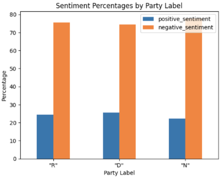
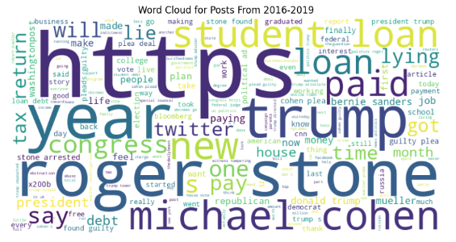
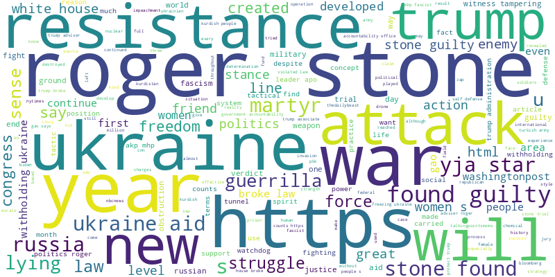
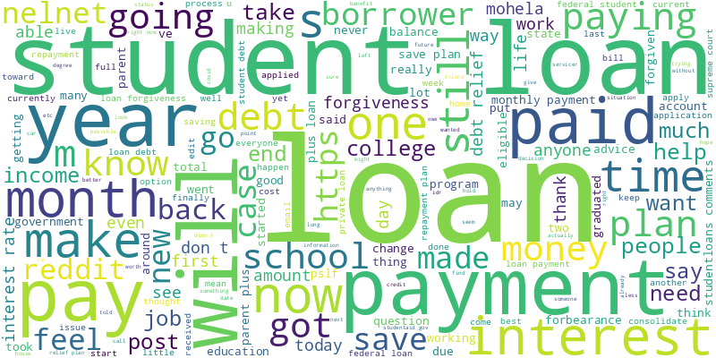

# Big Data Sentiment Analysis of Political Subreddits

## Project Overview
This project focuses on sentiment analysis of political discussions on Reddit. The goal is to analyze public opinion on specific political issues or keywords by examining the sentiment of posts and comments in political subreddits. We performed additional data analysis including whether there was a statistically significant correlation between sentiment and KPIs of posts (e.g. # of upvotes) as well as values as a distribution of time.

## Motivation
Politics is a divisive issue in the United States. By understanding public opinion on politicized topics and figures, we can gain insights into societal trends and biases.

## Hypotheses
- **Hypothesis 1:** Reddit posts with the keyword "Republican" will have a disproportionately negative sentiment trend because of the platform's user demographics.
- **Hypothesis 2:** Posts related to political issues will generally exhibit negative sentiment.

## Data Collection
We used a web crawler, specifically the Python Reddit API Wrapper (PRAW), to collect data from posts within political subreddits. The dataset consists of 9,729 posts with various attributes such as post title, body, time, upvotes, and comments.

- **Dataset Size:** 1.01GB
- **File Type:** JSON
- **Number of Records:** 9,729
- **Number of Attributes:** 7

<!-- Insert a screenshot of the JSON file used for data collection. -->

## Data Processing
Data processing was done using Apache Spark, with the cleaned data stored in a MySQL database. Key steps included:

- Replacing missing values
- Removing rows with no text
- Merging post title and body
- Converting text to lowercase
- Translating date columns
- Removing unnecessary columns

### Apache Spark Execution Time Evaluation Graphs
Impact of Number of Workers on Execution Time

<!-- Insert a graph showing the impact of the number of workers on execution time. -->

Impact of Dataset Size on Execution Time

<!-- Insert a graph showing the impact of dataset size on execution time. -->

## Sentiment Analysis
A machine learning model was trained using the **Natural Language Toolkit (NLTK)** library on a labeled Twitter dataset to predict the sentiment of Reddit posts. The model achieved an accuracy of 75.96% in classification of another labeled Twitter dataset. **NLTK** is a Python library for processing textual data, providing a suite of programs for symbolic and statistical natural language processing for English. It supports classification, tokenization, stemming, tagging, parsing, and semantic reasoning functionalities.

## Exploratory Data Analysis (EDA)

### Pearson Correlation Test
We conducted correlation analysis between various attributes (e.g., number of comments, upvotes) and the sentiment and found negligible correlations. 

### Sentiment Distribution Over Time
We analyzed the sentiment of Reddit posts over time to identify trends related to political discussions. The sentiment scores were aggregated by date, allowing us to observe whether public sentiment became more positive or negative over specific periods. This analysis helps to reveal how certain events or political developments influence public opinion on Reddit.

We found that there was no major fluctuation in sentiment distribution even during major election years. The negative sentiment of Reddit posts seems to remain consistent irrespective of time or major political events.

<!-- 
<!-- Insert a graph that shows the sentiment distribution over time, with clear labels for dates and sentiment scores. -->

### Party-Bias Sentiment Analysis
This section delves into the sentiment biases related to political parties. By comparing the sentiment associated with posts mentioning "Republican" versus "Democrat," we can uncover potential biases in how political parties are perceived on Reddit. The analysis includes an exploration of whether posts mentioning one party tend to have more negative sentiment compared to the other and the number of upvotes they receieve.

### Wordclouds
We generated Wordclouds as a way to visualize the most commmonly appearing keywords in Reddit posts aggregated by time period posted:

Wordclouds for posts aggregated by the party affiliation tag we created on the basis of keyword presence:

Users also had the ability to generate Wordclouds in real-time by keyword selection utilizing our cleaned dataset:

Ukraine

Student Loans

An interesting observation we made is that grouped Reddit posts with a higher frequency of the string "https" indicated that these types of posts contained more hyperlinks and were likely current-event, reactionary driven content.

### Instructions to Run
1. Log in to the EC2 instance: `cs179g-fall-2023-03.cs.ucr.edu`
2. Navigate to the project directory: `cd Reddit-Political-Sentiment-Analysis-Web-App`
3. Run the Streamlit app: `streamlit run Home_🏡.py --server.address localhost --server.port 8502`
4. Connect to local port 8052.

## Requirements
- **Front-End:** Streamlit
- **Back-End:** MySQL ApacheSpark
- **Libraries Used:** Matplotlib, Pandas, Seaborn, Plotly, WordCloud, Streamlit, TextBlob, NLTK

## Contributions
This project was a collaborative effort by Kendrew Christanto, Daniel Birouty, Jinseok Lee, and Toan Bao.